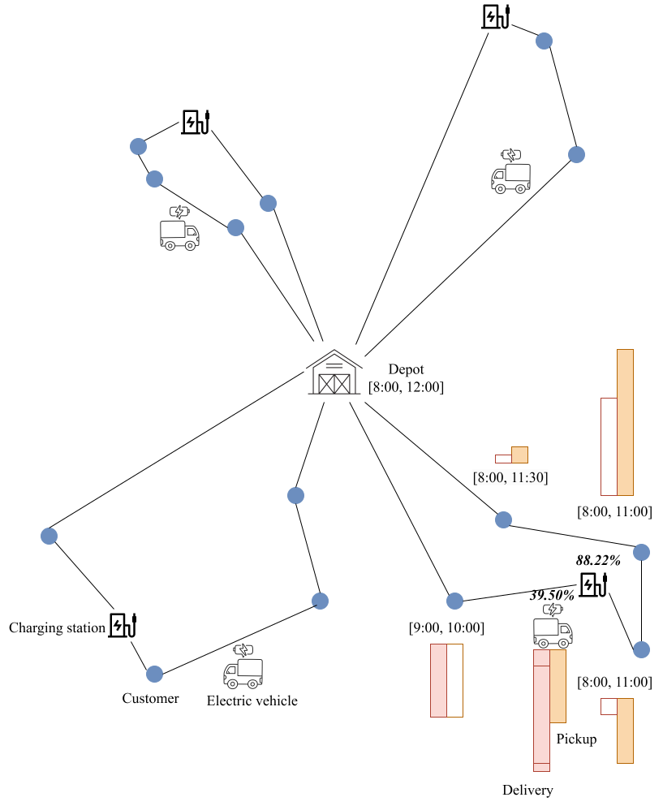

# EVRP-TW-SPD: HMA, Benchmark 


The HMA source code and datasets used in our paper, 'Hybrid Memetic Search for Electric Vehicle Routing with Time Windows, Simultaneous Pickup-Delivery, and Partial Recharges,' are available here.





## File Structure

```
EVRP-TW-SPD-HMA-code-dataset/
│
├── README.md                   # overview and instructions
│
├── src/                        # HMA source code 
│   ├── evrp_tw_spd_solver.cpp  # main function 
│   ├── evrp_tw_spd_solver.h   
│   └── ...  
│
├── data/                       # datasets used in our experiments
│   ├── akb_instances           # the akb set
│   ├── jd_instances            # the jd set (the new benchmark set)
│   └── README.md               # instance file structure
│
├── solution/                   # solutions obtained in 10 independent runs
│   ├── akb
│   ├── jd/
│   │   ├── small_timelimit
│   │   └── large_timelimit
│   │
│   └── README.md               # solution file structure
│
└── .gitattributes        
```


## Usage Instructions

To repeat our experiments in Linux, if the current directory is `EVRP-TW-SPD-HMA-code-dataset`, please run the following commands: 

```bash
mkdir bin
cd src
```

### **compile:**

```bash
g++ -std=c++11 -o ../bin/evrp-tw-spd -O3 evrp_tw_spd_solver.cpp eval.cpp operator.cpp search_framework.cpp solution.cpp util.cpp data.cpp evolution.cpp
```

### **execute:**

```bash
cd ..
./bin/evrp-tw-spd [--problem PROBLEM] [--pruning] [--output OUTPUT] [--time TIME] [--runs RUNS] [--g_1 G_1] [--pop_size POP_SIZE] [--init INIT] [--cross_repair CROSS_REPAIR] [--parent_selection PARENT_SELECTION] [--replacement REPLACEMENT] [--O_1_eval] [--two_opt] [--two_opt_star] [--or_opt OR_OPT] [--two_exchange TWO_EXCHANGE] [--elo ELO] [--related_removal] [--removal_lower REMOVAL_LOWER] [--removal_upper REMOVAL_UPPER] [--regret_insertion] [--individual_search] [--population_search] [--parallel_insertion] [--conservative_local_search] [--aggressive_local_search] [--station_range sr] [--subproblem_range K_SUBPROBLEM]
```

1. on small-scale instances with 5/10/15 customers, 2~8 stations:

```bash
./bin/evrp-tw-spd --problem ./data/akb_instances/c101c5.txt --pruning --time 105 --runs 10 --g_1 20 --pop_size 9 --init rcrs --cross_repair regret --parent_selection circle --replacement one_on_one --O_1_eval --two_opt --two_opt_star --or_opt 2 --two_exchange 2 --elo 1 --related_removal --removal_lower 0.2 --removal_upper 0.4 --regret_insertion --individual_search --population_search --parallel_insertion --conservative_local_search --aggressive_local_search --station_range 1.0 --subproblem_range 1
```

2. on medium-scale instances with 100 customers, 21 stations:

```bash
./bin/evrp-tw-spd --problem ./data/akb_instances/c101_21.txt --pruning --time 630 --runs 10 --g_1 20 --pop_size 4 --init rcrs --cross_repair regret --parent_selection circle --replacement one_on_one --O_1_eval --two_opt --two_opt_star --or_opt 2 --two_exchange 2 --elo 1 --related_removal --removal_lower 0.1 --removal_upper 0.2 --regret_insertion --individual_search --population_search --parallel_insertion --conservative_local_search --aggressive_local_search --station_range 0.5 --subproblem_range 1
```

3. on large-scale instances with 200/400/600/800/1000 customers, 100 stations `--subproblem_range 2/4/6/8/10`:

```bash
./bin/evrp-tw-spd --problem ./data/jd_instances/jd200_1.txt --pruning --time 1800 --runs 10 --g_1 20 --pop_size 4 --init rcrs --cross_repair regret --parent_selection circle --replacement one_on_one --O_1_eval --two_opt --two_opt_star --or_opt 2 --two_exchange 2 --elo 1 --related_removal --removal_lower 0.05 --removal_upper 0.05 --regret_insertion --individual_search --population_search --parallel_insertion --aggressive_local_search --station_range 0.1 --subproblem_range 2
```
