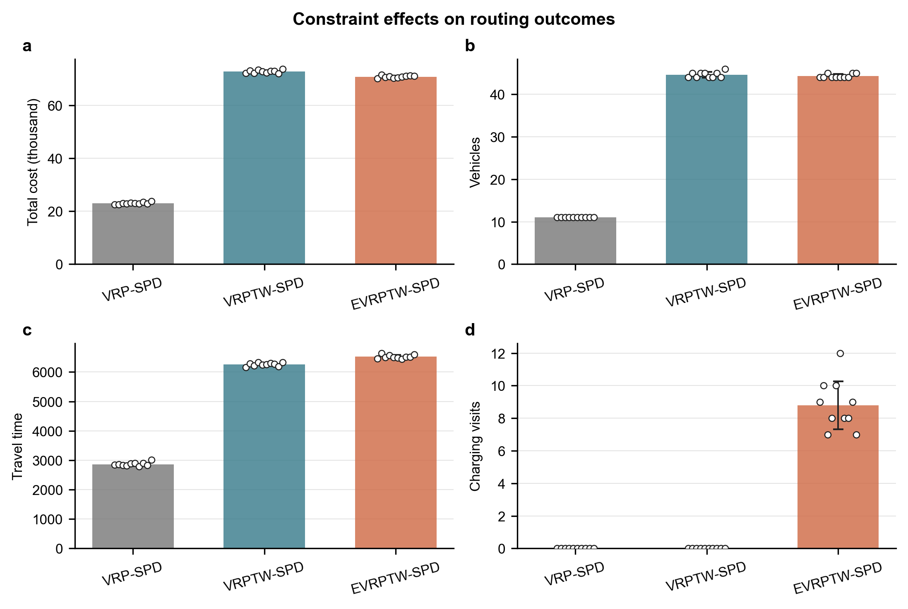
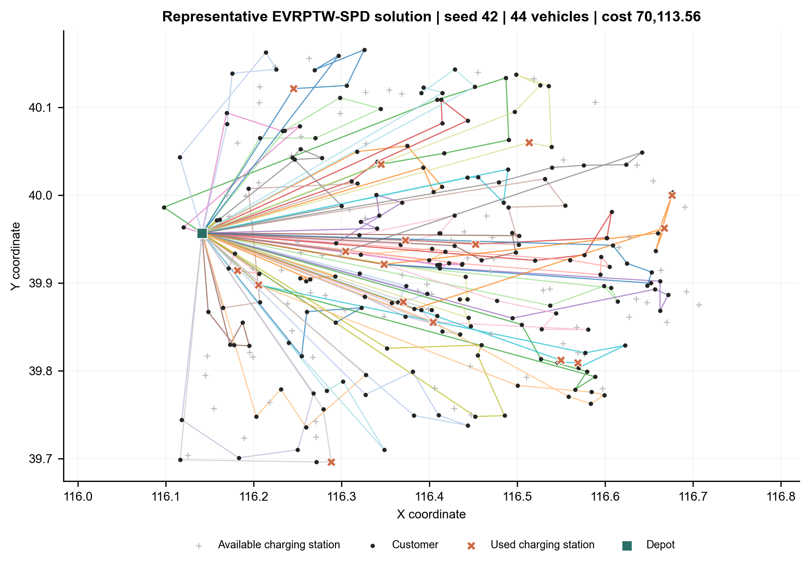

# 正式实验结果解读

## 1. 实验设置

实验使用公开实例 `jd200_1`，包括 1 个仓库、200 个客户和 100 个候选充电站。三个模型共享客户、取送货需求、车辆容量、路网距离、行驶时间、随机种子、搜索参数和 1800 秒求解上限。随机种子为 42 至 51。

对照模型依次加入约束：

| 模型 | 同步取送货 | 时间窗 | 电池与充电 |
|---|---|---|---|
| VRP-SPD | 启用 | 放宽 | 放宽 |
| VRPTW-SPD | 启用 | 启用 | 放宽 |
| EVRPTW-SPD | 启用 | 启用 | 启用 |

每个完整 EVRPTW-SPD 解都经过独立复核。200 位客户均被服务一次，所有路线均从仓库出发并返回仓库，容量、时间窗和电池状态约束全部满足。

## 2. 核心结果

| 模型 | 车辆数 | 总成本 | 总距离 | 总行驶时间 | 充电次数 |
|---|---:|---:|---:|---:|---:|
| VRP-SPD | 11.00 ± 0.00 | 23028.33 ± 351.17 | 1409166.60 ± 25083.29 | 2865.60 ± 62.41 | 0.00 ± 0.00 |
| VRPTW-SPD | 44.60 ± 0.66 | 72797.65 ± 563.63 | 4244118.00 ± 28558.63 | 6261.30 ± 53.67 | 0.00 ± 0.00 |
| EVRPTW-SPD | 44.30 ± 0.46 | 70859.19 ± 437.68 | 4112085.20 ± 29756.93 | 6521.50 ± 60.77 | 8.80 ± 1.47 |

表中数值为十个随机种子的均值与总体标准差。

## 3. 时间窗影响

加入时间窗后，车辆数从 11.00 辆增至 44.60 辆，平均增加 305.45%。总行驶时间增加 118.59%，总成本增加 216.17%。车辆数变化的配对均值 95% 置信区间为 300.91% 至 310.00%，说明时间窗对运力规模的影响在当前实例和搜索设置下具有较强一致性。

这一变化表明，客户服务时段限制压缩了订单合并和连续配送的空间。车辆需要承担更短、更分散的路线，以便在规定时段内完成服务。该结果将时间窗识别为本实例中影响车辆配置和运输成本的主要约束。

## 4. 续航与补能影响

在时间窗模型上加入电池和充电约束后，总行驶时间平均增加 4.16%，配对均值 95% 置信区间为 3.48% 至 4.84%。每次求解均产生充电行为，平均访问充电站 8.80 次，平均充电时间为 13.73。十个种子的行驶时间增幅介于 2.24% 至 5.66%，表明补能安排持续占用运输时间。所有完整解的最低剩余可行驶距离均达到 0，续航约束在实际路线中被激活。

EVRPTW-SPD 的平均总距离比 VRPTW-SPD 低 3.11%，平均总成本低 2.66%。两个模型由启发式算法独立搜索，1800 秒内未提供全局最优性证明，因此该差异反映当前计算预算下得到的可行解质量。车辆数变化为负 0.65%，其 95% 置信区间为负 1.97% 至 0.67%，没有显示稳定的方向。续航约束的稳定影响体现在行驶时间和充电行为两个维度。

## 5. 稳健性

三个模型的总成本变异系数分别约为 1.52%、0.77% 和 0.62%。VRPTW-SPD 使用 44 至 46 辆车，EVRPTW-SPD 使用 44 至 45 辆车。主要结论没有依赖单个随机种子。

十种子实验采用相同种子的配对统计口径。置信区间使用配对百分比变化的样本标准差和双侧 95% t 区间计算。

## 6. 图表

模型对比图展示各模型的均值、总体标准差和十次独立运行结果：

代表性路线图选择车辆数最少且成本最低的完整 EVRPTW-SPD 解，对应随机种子 42、44 辆车和总成本 70113.56：

## 7. 结论

统一数据实验表明，时间窗是当前配送实例中改变车辆配置和成本结构的主要约束。新能源车辆在满足相同客户服务要求的基础上形成了稳定的补能需求，并带来约 4.16% 的行驶时间增量。完整电动车路径在十个随机种子下均保持可行，说明求解流程能够同时处理同步取送货、时间窗、续航和充电决策。
